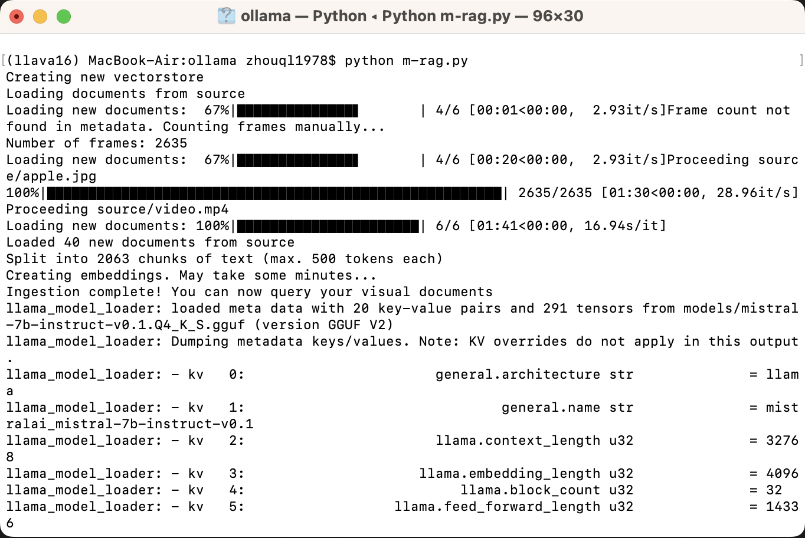
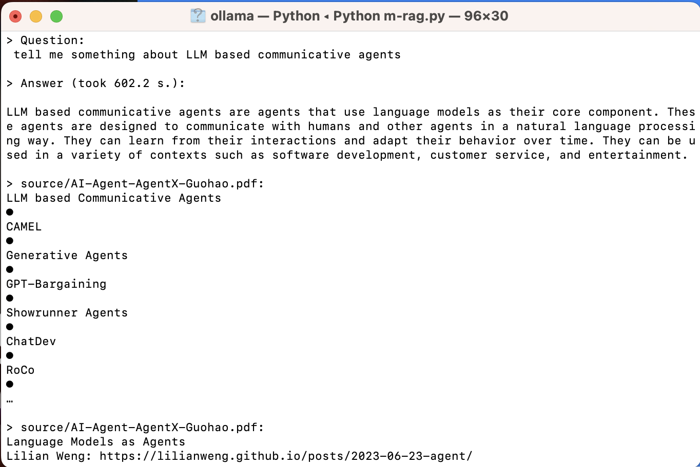
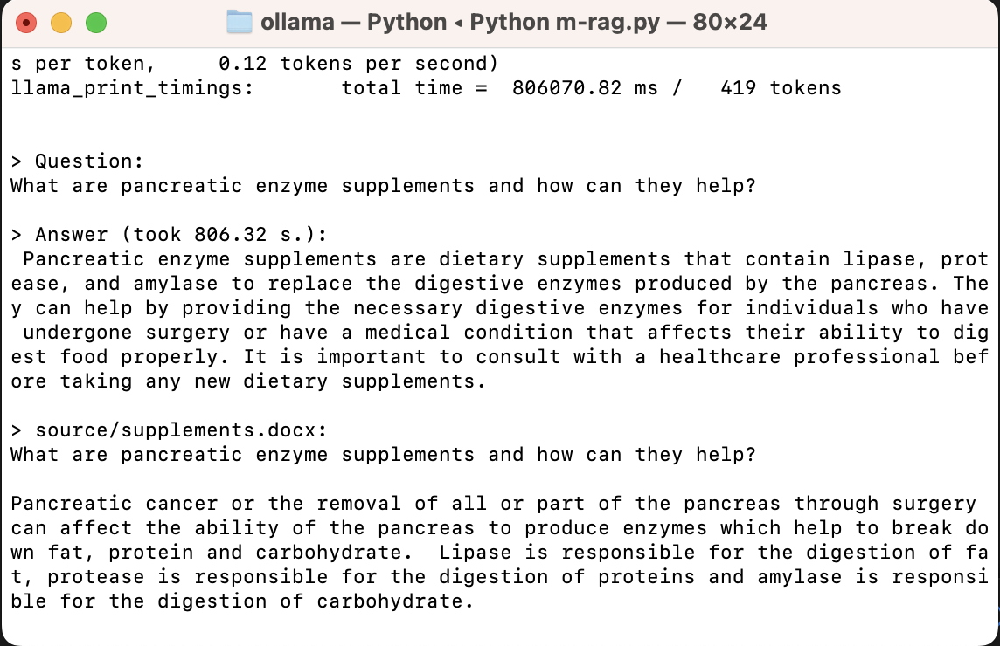

# <center> **Multimodal RAG** </center>

Build your own **Multimodal RAG** Application using less than 300 lines of code.

You can talk to any documents with LLM including Word, PPT, CSV, PDF, Email, HTML, Evernote, Video and image.






* **Features**
    - Ingest your videos and pictures  with Multimodal LLM
    - Q&A with LLM about any files
    - Run locally without compromising your privacy
    - Locating the relevant resource with citation
    - Extremely simple with only one python file with no more than 300 lines of code
* **Process**
    - Parse videos or pictures in the folder into text with LLava, which run locally with ollama, and ingest other types of files with LangChain.
    - Ingest the text into vectorDB
    - Query it with local LLM.
* **Setup**
    - **Create and activate virtual environment**
        
        ```bash
        python -m venv m-rag
        source m-rag/bin/activate
        ```
        
    - **Clone repo and install dependencies**
    
      ```bash
      git clone https://github.com/13331112522/m-rag.git
      cd m-rag
      python -m pip install -r requirements.txt
      cp example.env .env
      ```
    
    - **Get ready for models**
        - Put local LLM weights into folder _models_, supporting any GGUF format, and change the MODEL_PATH in .env for your model path. You can download the weights by visiting [Huggingface/theBloke](https://huggingface.co/TheBloke). We use [mistral-7b-instruct-v0.1.Q4_K_S.gguf](https://huggingface.co/TheBloke/Mistral-7B-Instruct-v0.2-GGUF) as our LLM for query.
        - We currently employed the HuggingfaceEmbedding, but you can change it to local embedding like GPT4ALLEmbedding by changing the EMBEDDINGS_MODEL_NAME in .env.
        - Run MLLM. We employ the latest llava 1.6 for image and video parsing.
        
        ```bash
        ollama run llava
        ```
    - **Environment variables setting**
      
        - Change the environment variables according to your needs in .env. _SOURCE_DIRECTORY_ refers to the folder which contains all the images and videos you want to retrieve, and _STRIDE_ refers to the frame interval for video parse. For long video parse, you can change stride to big number for higher process speed but less details.
        - Replace with the actual path to your FFmpeg executable in _os.environ["IMAGEIO_FFMPEG_EXE"] = "/path/to/ffmpeg"_ to leverage the FFmpeg backend.
  
    - **Run**
        
        Put all the files you want to talk with into the folder _source_. Run following command:
        
        ```bash
        python m-rag.py
        ```
        
      
        It will generate the folder _source_documents_ as the storage of parsed text and _faiss_index_ as the vectorDB. If the two folders already exist, it will start query directly.
* **Acknowledgement**
    - llava 1.6
    - PrivateGPT
    - ollama
    - langchain
    - Llama.cpp
